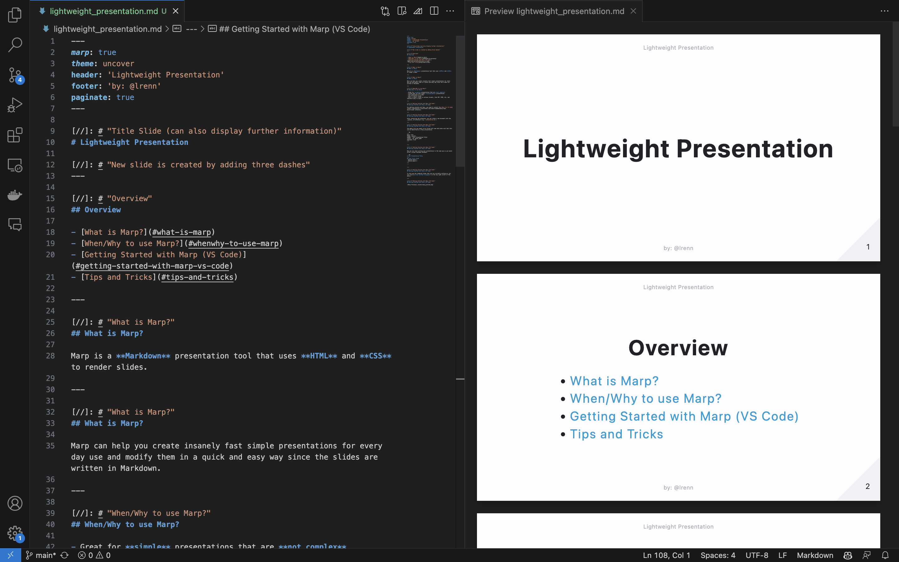

[//]: # "Title Slide (can also display further information)"
# Lightweight Presentation

[//]: # "New slide is created by adding three dashes"
---

[//]: # "Overview"
## Overview

- [What is Marp?](#what-is-marp)
- [When/Why to use Marp?](#whenwhy-to-use-marp)
- [Getting Started with Marp (VS Code)](#getting-started-with-marp-vs-code)
- [Syntax and Slides](#syntax-and-slides)

---

[//]: # "What is Marp?"
## What is Marp?

Marp is a **Markdown** presentation tool that uses **HTML** and **CSS** to render slides.

---

[//]: # "What is Marp?"
## What is Marp?

Marp can help you create insanely fast simple presentations for every day use and modify them in a quick and easy way since the slides are written in Markdown.

---

[//]: # "When/Why to use Marp?"
## When/Why to use Marp?

- Great for **simple** presentations that are **not complex**
- Suited when you want highly **customizable** presentations
- Fast generation of slides
- Easy to modify slides
- Easy to export slides to various formats, like PDF, HTML, etc. and therefore easy to share

---

[//]: # "Getting Started with Marp (VS Code)"
## Getting Started with Marp (VS Code)

For getting started with Marp, you need to install the [Marp for VS Code](https://marketplace.visualstudio.com/items?itemName=marp-team.marp-vscode) extension.

---

[//]: # "Getting Started with Marp (VS Code)"
## Getting Started with Marp (VS Code)

After installing the extension, you can create a new document with the _typical_ md extension (e.g. `presentation.md`).

---

[//]: # "Getting Started with Marp (VS Code)"
## Getting Started with Marp (VS Code)

The empty file now needs to be filled with some meta data such that this can be identified as a Marp presentation.

```md
---
marp: true
theme: uncover
header: 'Your Presentation Title'
footer: 'by: @your_name'
paginate: true
---
```

---

[//]: # "Getting Started with Marp (VS Code)"
## Getting Started with Marp (VS Code)

Now you can start writing your presentation in the same way as you would write a normal Markdown document.

```md
# Your Presentation Title
---
## Your first slide
- Bullet point 1
- Bullet point 2
---
...
```

---

[//]: # "Getting Started with Marp (VS Code)"
## Getting Started with Marp (VS Code)

To also see the rendered slides that you are currently working on, you can click on **the preview icon** in the top right corner of the editor.

---

[//]: # "Getting Started with Marp (VS Code)"
## Getting Started with Marp (VS Code)



---

[//]: # "Getting Started with Marp (VS Code)"
## Getting Started with Marp (VS Code)

To export your presentation, you can can open the **command palette** and search for `Marp: Export slide deck`.

---

[//]: # "Syntax and Slides"
## Syntax and Slides

As already mentioned before Marp is extremely suited for simple presentations. For more complex presentations, you might want to use a different tool like Keynote or PowerPoint.<br>


---

[//]: # "Syntax and Slides"
## Syntax and Slides

The more complex your slide needs to be, the more you need to write customized _code_ that can sometimes be real pain. Nevertheless, if you put in the effort to once have a template for a variety of slides, you can reuse them in the future and make marp a great tool for **all** your presentations.

---

[//]: # "Syntax and Slides"
## Syntax and Slides

### Sample Slides

---


[//]: # "Syntax and Slides"
## Syntax and Slides

### Sample Slides

---


[//]: # "Syntax and Slides"
## Syntax and Slides

### Sample Slides

---

[//]: # "Syntax and Slides"
## Syntax and Slides

List with animation:

* Bullet point 1
* Bullet point 2
* Bullet point 3

When exporting the slides to HTML the bullet points are shown one after another. In PDF, all bullet points are shown at once.

---

[//]: # "Syntax and Slides"
## Syntax and Slides

Table in Markdown:

| Column 1 | Column 2 | Column 3 |
| -------- | -------- | -------- |
| Cell 1   | Cell 2   | Cell 3   |
| Cell 4   | Cell 5   | Cell 6   |

---

[//]: # "Syntax and Slides"
## Syntax and Slides

TODOs list do not work in Marp, but you can use the following workaround:

:white_check_mark: Task 1
:white_check_mark: Task 2
:black_square_button: Task 3
  
---

[//]: # "Syntax and Slides"
## Syntax and Slides

Support for math equations:

$$
\begin{align}
\frac{1}{2} \cdot \frac{1}{3} &= \frac{1}{6} \\
\end{align}
$$

---

[//]: # "Syntax and Slides"
## Syntax and Slides

Support for **syntax highlighted code blocks**:

```python
def hello_world():
    print("Hello World!")
```
---

[//]: # "Syntax and Slides"
## Syntax and Slides

To add your own theme, you can create a CSS file and add it to the meta data of your presentation. <br>
Instead of `theme: uncover` you can then use `theme: your_theme.css`.

---

[//]: # "Syntax and Slides"
## Syntax and Slides

The css file looks like this:

```css
/* @theme your-theme */

@import 'default';

h1 {
  color: red;
}
```

Taken from [here]([https://github.com/orgs/marp-team/discussions/115](https://marpit.marp.app/theme-css)).

---

[//]: # "Conclusion"
## Conclusion

Marp is a great tool for creating simple presentations. As a markdown lover I really like using it and learn more about it. <br>

Check out the [Marpit Documentation](https://marpit.marp.app/) for more information.


