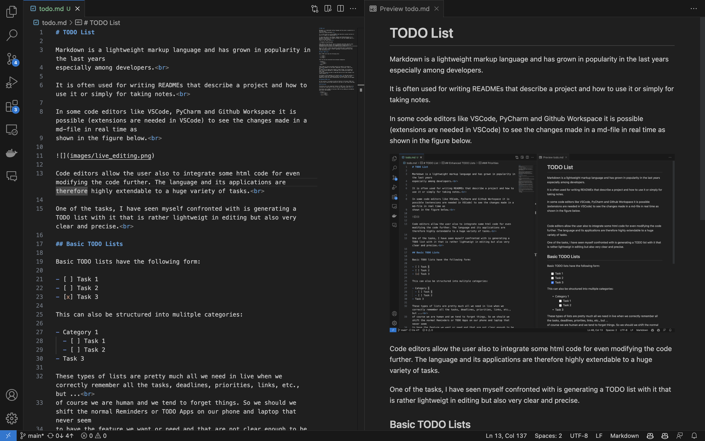

# TODO List

Markdown is a lightweight markup language and has grown in popularity in the last years 
especially among developers. 

It is often used for writing READMEs that describe a project and how to use it or simply for taking notes. 

In some code editors like VSCode, PyCharm and Github Workspace it is possible (extensions are needed in VSCode) to see the changes made in a md-file in real time as
shown in the figure below. 

Code editors allow the user also to integrate some html code for even modifying the code further. The language and its applications are therefore highly extendable to a huge variety of tasks. 

One of the tasks, I have seen myself confronted with is generating a TODO list with it that is rather lightweigt in editing but also very clear and precise. 

## Basic TODO Lists

Basic TODO lists have the following form:

- [ ] Task 1
- [ ] Task 2
- [x] Task 3

This can also be structured into mulitple categories:

- Category 1
  - [ ] Task 1
  - [ ] Task 2
- Task 3

These types of lists are pretty much all we need in live when we correctly remember all the tasks, deadlines, priorities, links, etc., but ... 
of course we are human and we tend to forget things. So we should we shift the normal Reminders or TODO Apps on our phone and laptop that never seem 
to have the feature we want or need and that are not clear enough to be really helpful. 

The answer to this question is of course **No**. In the next section, I am going to show you a enhanced version of the basic todo list and demonstrate that with easy customizations lots of features can be added.

## Enhanced TODO Lists

In this section, I am going to add new features to the basic TODO list. You are free to add as many features as you want or just leave them away.

### Priorities

Priorities are a very important feature of TODO lists. They help us to structure our tasks and to focus on the most important ones first. 

Priorities can be added to the basic TODO list by adding an exclamation mark after the brackets:

- Category 1
  - [ ] !! Task 1
  - [ ] ! Task 2
- [x] !!! Task 3

This is already a very good start but we can do better. We can add colors to the priorities to make them even more visible:

- Category 1
  - [ ] !! Task 1
  - [ ] ! Task 2
- [x] !!! Task 3

The color code is an extra indicator of which tasks ranks higher in the priority list. The colors can be changed to your liking. 

### Due Dates

Due dates are another important feature of TODO lists. They help us to keep track of deadlines and to focus on the tasks that are due soon. 

They can be added after the priorities for example:

- Category 1
  - [ ] !! 10.07.2023 Task 1
  - [ ] ! 11.07.2023 Task 2 
- [ ] !!! 12.07.2023 Task 3

The date can be highlighted by making it bold:

- Category 1
  - [ ] !! **10.07.2023** Task 1
  - [ ] ! **11.07.2023** Task 2
- [ ] !!! **12.07.2023** Task 3

The TODO list is slowly coming together but we can still do better.

### Notes

Generally it is alway helpful to have notes describing the tasks and adding additional information. This can be simply done by adding a blockquote below the task:

- Category 1
  - [ ] !! **10.07.2023** Task 1
  > This is a note for Task 1.
  - [ ] ! **11.07.2023** Task 2
  > This is a note for Task 2.
- [ ] !!! **12.07.2023** Task 3
  > This is a note for Task 3.

This is very useful but the background color of the blockquote is not very appealing. We can change that by adding some more html code:

- Category 1
  - [ ] !! **10.07.2023** Task 1
    <blockquote style="color: lightblue; background-color: transparent;">
    This is a note for Task 1.
    </blockquote>
  - [ ] ! **11.07.2023** Task 2
    <blockquote style="color: lightblue; background-color: transparent;">
    This is a note for Task 2.
    </blockquote>
- [ ] !!! **12.07.2023** Task 3
  <blockquote style="color: lightblue; background-color: transparent;">
  This is a note for Task 3.
  </blockquote>

The notes are now dislpayed in a nice lightblue color with a transparent background that is especially in dark modes very nice to look at. 

### Solutions

Sometimes tasks are also a problem that need a solution. When we find a solution we immidiately want to write it down so that we can use it later. 

This can be done by adding another section in the blockquote section:

- Category 1
  - [ ] !! **10.07.2023** Task 1
    <blockquote style="color: lightblue; background-color: transparent;">
    This is a note for Task 1.
    </blockquote>
  - [ ] ! **11.07.2023** Task 2
    <blockquote style="color: lightblue; background-color: transparent;">
    This is a note for Task 2.
    </blockquote>
- [ ] !!! **12.07.2023** Task 3
  <blockquote style="color: lightblue; background-color: transparent;">
  This is a note for Task 3.
  

  Solution to Task 3.
  

  </blockquote>

Now we have a nice TODO list with all the features we need. It is easy to edit and very clear to read. 

### Font Sizes
Categories, subcategories, tasks, etc. can be differentiated by using different font sizes. 

- Category 1
  - [ ] !! **10.07.2023** Task 1
    <blockquote style="color: lightblue; background-color: transparent;">
    This is a note for Task 1.
    </blockquote>
  - [ ] ! **11.07.2023** Task 2
    <blockquote style="color: lightblue; background-color: transparent;">
    This is a note for Task 2.
    </blockquote>
- [ ] !!! **12.07.2023** Task 3
  <blockquote style="color: lightblue; background-color: transparent;">
  This is a note for Task 3.
  

  Solution to Task 3.
  

  </blockquote>

### Others

The notes and solutions can be further extended by adding links, images, etc. to them. They can be added in the typical markdown way. 

Here are some good resources for markdown:
- [Code Academy](https://www.codecademy.com/resources/docs/markdown)
- [Markdown Guide](https://www.markdownguide.org/basic-syntax/)

## Conclusion

Personally, I use this TODO list every day and it helps me to stay organized and to keep track of my tasks. It is also very helpful that these md-files can be quickly edited and exported to pdf.  

The basic structure of the TODO list can be very helpful for tasks that do not require much complexity, such as a checklist when packing for a trip.  

The enhanced version is a real game changer for complex task because you can easily keep track of everything and you can add as much information as you want.  

Moreover, I suggest to just copy the TODO list every day from the previous day and to delete the tasks that are already done. 

In that way it will be very easy to look up tasks from a specific date and to keep track of your progress. 

From a mental healthy point of view I propose to add a section where you can write down your thoughts and feelings. This is very helpful to refelct, improve and motivate yourself. 

This can maybe look like this:

- **Memories**
  <blockquote style="background-color: transparent;">
    ...
  </blockquote> 
- **Quote**
  <blockquote style="background-color: transparent;">
    ...
  </blockquote> 
- **Learned**
  <blockquote style="background-color: transparent;">
    ...
  </blockquote> 
- **Goals** 
  <blockquote style="background-color: transparent;">
    ...
  </blockquote>
- **Achievements**
  <blockquote style="background-color: transparent;">
    ...
  </blockquote> 

I hope this will help you to stay organized and to keep track of your tasks.  

